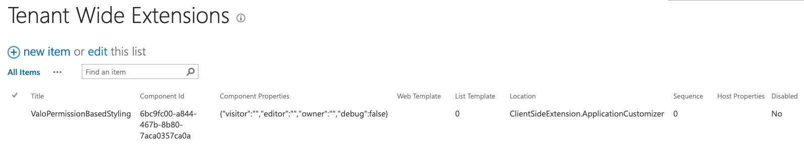

# Valo Permission Based Styling - Application Customizer

This is a solution which can be used to specify custom styling for owners, editors, or visitors. This allows you as a Valo partner to show or hide certain functionality for the end-user. 

> **Info**: In the future this functionality will be embedded in our `Lightsaber`. Until now then you can make use of this solution.

## Installation

You have to options to install this solution:

1. Use the provided `sppkg` ([valo-permission-styling.sppkg](./package/valo-permission-styling.sppkg)) and upload the package to the **app catalog** of the tenant. Next step is to follow the configuration steps.
2. Build the package yourself.
    - In order to build it yourself, you first need to clone the repository to your machine: `git clone https://github.com/ValoIntranet/valo-permissions-based-styling`.
    - Navigate to the solution folder.
    - Run: `npm i`.
    - Do the changes you want to apply (optional).
    - Bundle and package the solution.
    - Upload it to the **app catalog**.

> **Important**: When you upload the package, the solution will ask you if you want to deploy the application customizer globally. If you do not check the checkbox, you will have to manually enable the application customizer on each and every site.

## Configuration

If you choose to activate the application customizer to be enabled tenant-wide, you can follow the next configuration steps:

- On the app catalog, navigate to the **Tenant Wide Extensions** list: `https://<tenant>.sharepoint.com/sites/<catalog>/Lists/TenantWideExtensions`.
- In the list you will find the following record:
  
- The component has the following properties `{"visitor":"","editor":"","owner":"","debug":false}`:
  - `visitor`: The CSS for a person who can only view pages;
  - `editor`: The CSS for a person who can edit items in the current list/library (example: for a page this is the Site Pages library);
  - `owner`: The CSS for an owner of a site (Person who has `manageWeb` permissions).
  - `debug`: `true` or `false`. Shows which CSS gets applied to the page.
- To add custom CSS for a permission scope, edit the current item and add the CSS. For example, if you want to hide the Valo Toolbox for visitors, all you need to do is add the following: 

  ```json
  {
    "visitor": ".valo-toolbox__container{display:none;}",
    "editor": "",
    "owner": "",
    "debug": false
  }
  ```

- Save the item and navigate to your page to verify if this works.

## Package

The latest version of the package can be downloaded here: [valo-permission-styling.sppkg](./package/valo-permission-styling.sppkg).
